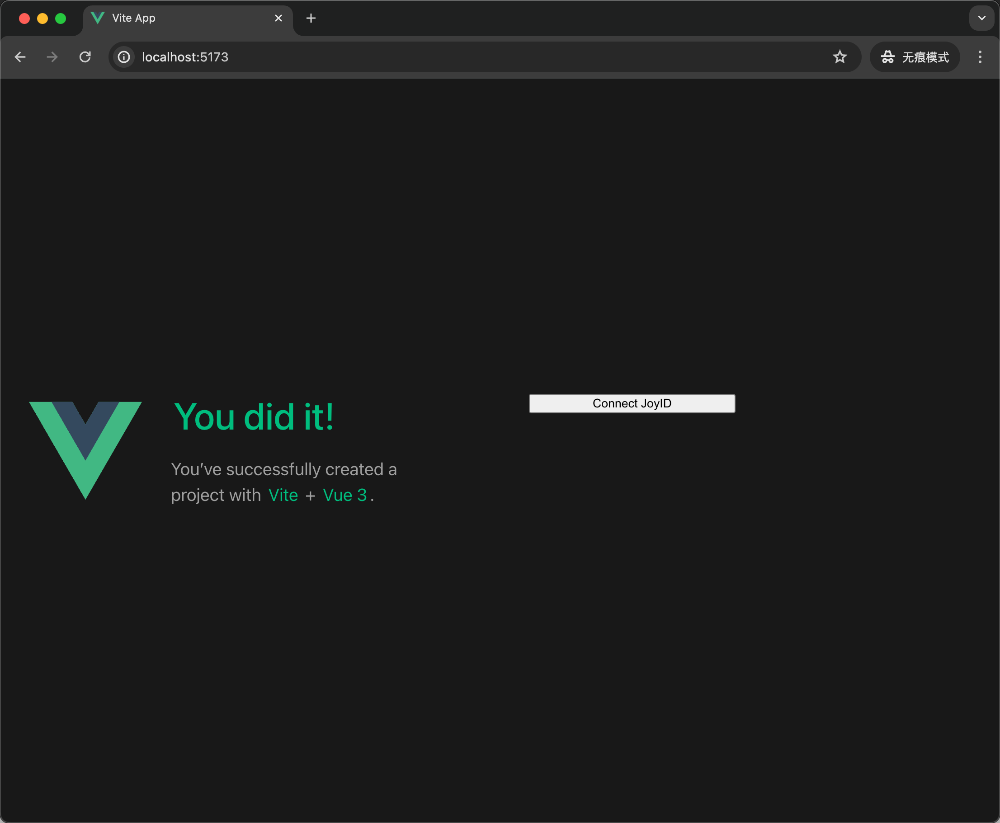
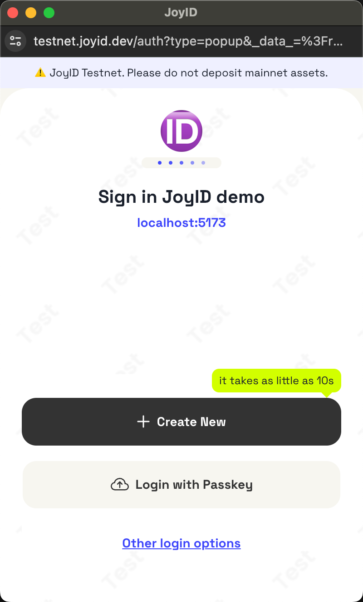
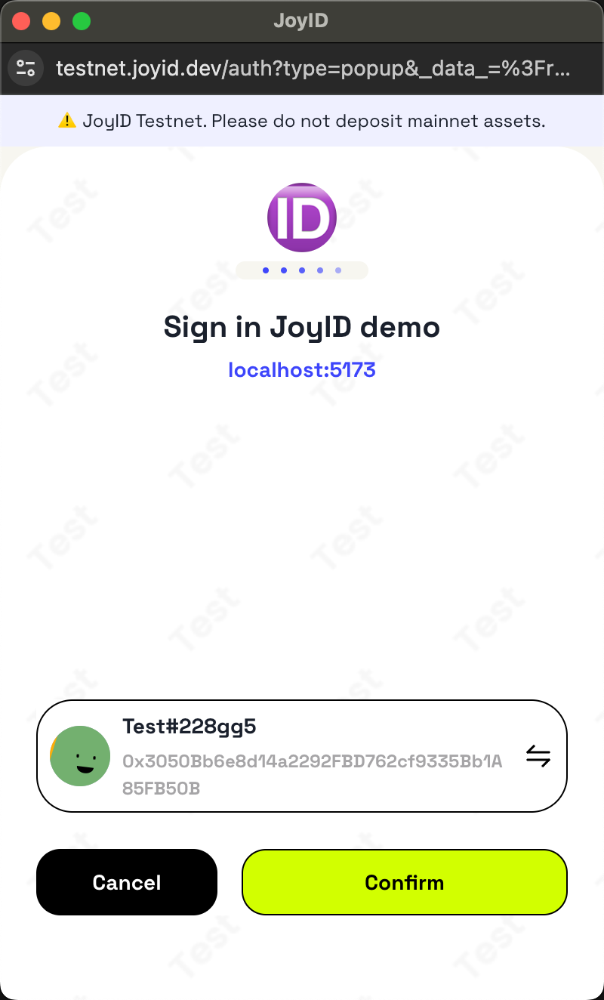
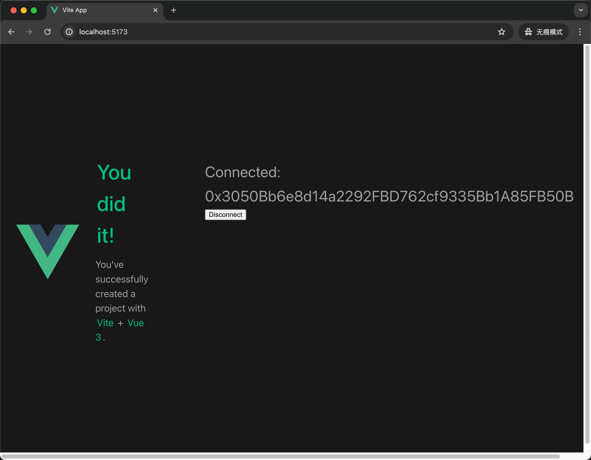

## Try it

## 1. Prepare a joy id in TestNet

Create one from here: [https://testnet.joy.dev](https://testnet.joyid.dev/)

## 2. Setup Project

```sh
npm install
```

### Compile and Hot-Reload for Development

```sh
npm run dev
```

## 3. Have a try

Click the `Connect JoyID` button:



Click the `Login with Passkey`:



Confirm it:



Check the **EVM** ID:



Click `Disconnect` button and everything back to the start, have fun!